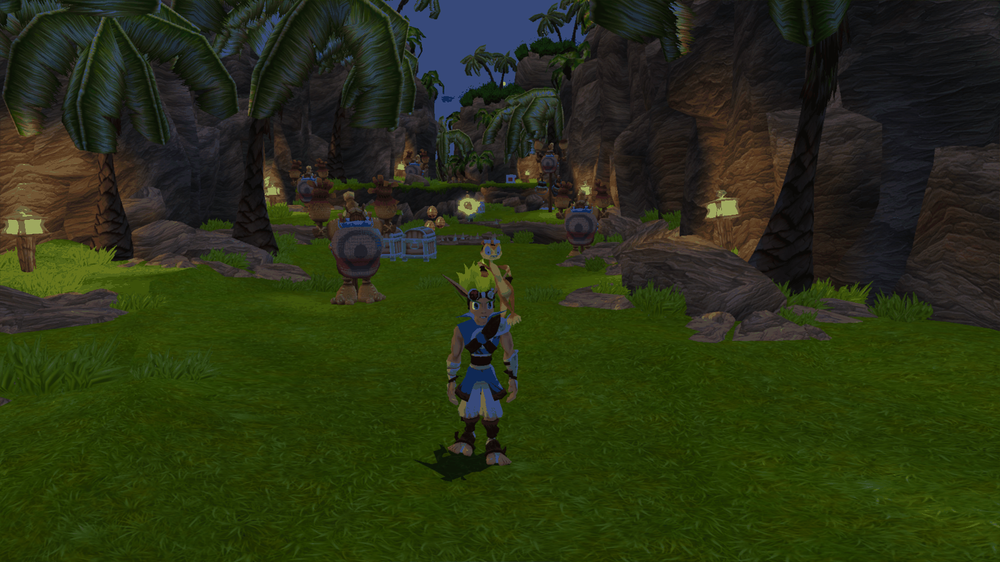
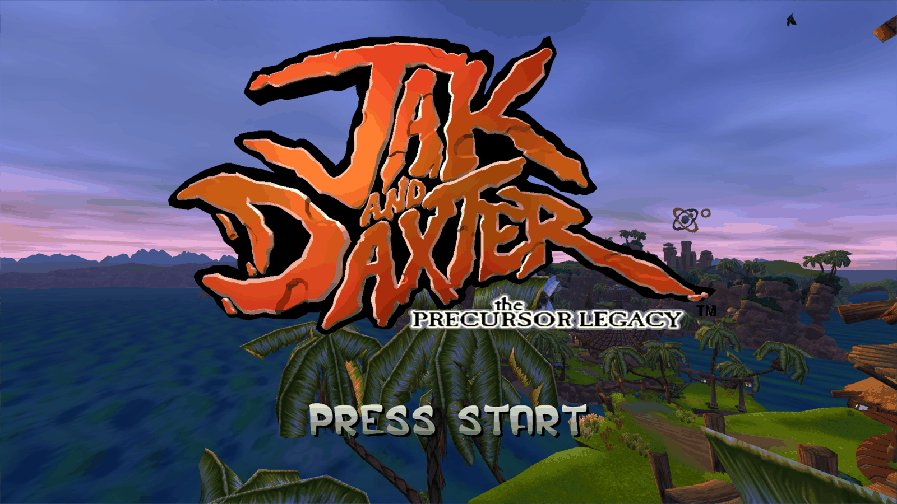
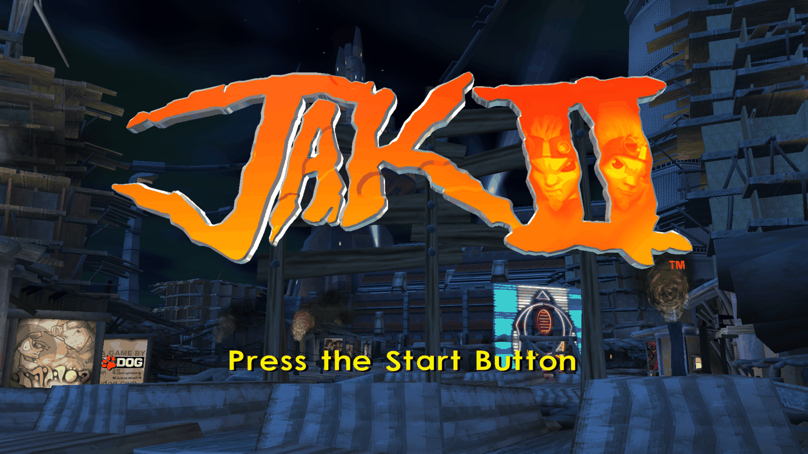
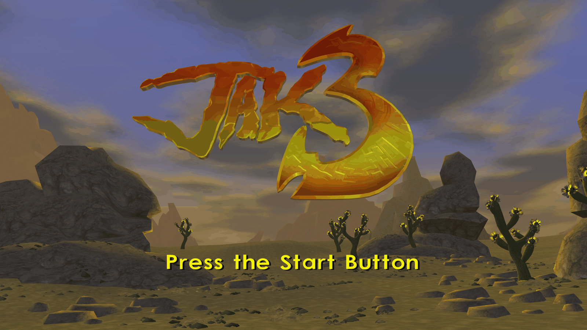

# OpenGOAL on Apple Silicon — native ARM64 macOS, Jak 1, Jak 2 **and** Jak 3

> **You are on the `angle-backend` branch.** It is `main` plus an opt-in
> **ANGLE-Metal graphics backend** (GLES 3.0 → Metal), verified at
> [`v1.1-angle-verified`](#the-angle-metal-backend-this-branch). AppleGL remains
> the default and the shipping backend; nothing changes unless you set
> `GK_GFX_BACKEND=angle`. See **[The ANGLE-Metal backend](#the-angle-metal-backend-this-branch)**
> and the **[branch map](#branch-map)**.

Run **Jak and Daxter: The Precursor Legacy**, **Jak II** and **Jak 3** natively
on Apple Silicon. No Rosetta, no translation layer — the GOAL compiler emits
ARM64 directly and the runtime executes it.



<sub>Jak 1 on Apple Silicon, HD texture pack installed.</sub>

| | | |
|---|---|---|
|  |  |  |
| <sub>Jak 1 title screen</sub> | <sub>Jak 2 title screen</sub> | <sub>Jak 3 title screen</sub> |

See **[diag/native-audit.md](diag/native-audit.md)** for a verification 
covering process translation flags, every mapped Mach-O image, live
disassembly of JIT'd GOAL code in the running games, and the build artifacts —
each with the command and its actual output. **All three games pass every
check**.

**Status**

| Game | State |
|---|---|
| **Jak 1** | **Playable.** Beach, Forbidden Jungle, Sandover Village and Geyser Rock play. Full playthrough not yet validated. |
| **Jak 2** | **Playable.** Full playthrough not yet validated. |
| **Jak 3** | **Playable.** Boots into gameplay. Full playthrough not yet validated. |

---

## Lineage

This project stands on two others, and the history here preserves both:

- **[open-goal/jak-project](https://github.com/open-goal/jak-project)** — the
  decompilation, the GOAL compiler, and the runtime. Everything here is
  downstream of that work.
- **[DiMiTriFrog/jak2-macos-arm64](https://github.com/DiMiTriFrog/jak2-macos-arm64)**
  — the original ARM64 backend: `IGenARM64`, the ARM64 register model, the
  C↔GOAL bridges, and the Jak 2 port. That fork made native Apple Silicon
  possible.

**What this repository adds:**

1. **Jak 1 support on ARM64** — the upstream Jak 1 game restored into the ARM64
   fork (which had removed it), and the compiler/runtime gaps that surfaced only
   once Jak 1 exercised them.
2. **Jak 3 support on ARM64** — grafted from upstream and ported to the ARM64
   kernel, runtime and heap model. Jak 3 had never run natively on Apple Silicon
   before this work.
3. **Bug fixes** in the shared ARM64 kernel, compiler and runtime paths, each
   documented with the evidence that found it (see below). Several are
   architecture-general and affect all three games.
4. **Regression coverage** for the bug classes that produced most of them.

---

## Engineering notes

Two documents carry the detail of what the port actually involved:

- **[PORTING-NOTES.md](PORTING-NOTES.md)** — the engineering reference. The
  recurring bug classes, ARM64 traps, code-density and heap-sizing findings, and
  techniques for debugging a JIT'd Lisp runtime.
- **[CASE-STUDIES.md](CASE-STUDIES.md)** — multi-session bug hunts written up in
  full, *including the falsified hypotheses and the misreadings*. The wrong
  turns are the point: they show which techniques pay off, and in what order.

---

## Requirements

- Apple Silicon Mac (developed on M4 Pro), macOS.
- `brew install cmake ninja go-task`
- **Your own legally-purchased game discs.** No assets are included and none can
  be. See [Legal](#legal).

## Build

```sh
cmake -B build --preset=Release-macos-arm64-clang
cmake --build build --parallel "$(sysctl -n hw.logicalcpu)"
```

## Extract assets from your disc

Copy your disc image contents into `iso_data/jak1/` (or `iso_data/jak2/`,
`iso_data/jak3/`), then:

```sh
./build/decompiler/extractor --folder --decompile --game jak1 iso_data/jak1
```

Extraction runs levels **in parallel and out of order** — an interrupted run
leaves an arbitrary subset with no error. If assets later appear missing, check
that all level `.fr3` files are present before assuming a code problem.

**Stage from the disc image, not from a mounted copy.** `buildinfo.json` is
*generated* by `extractor --extract` and is not present on the disc; without it
the extractor silently falls back to assuming "Jak 1 NTSC-U Black Label" and
fails on anything else. A byte-perfect file-tree copy cannot reveal this. If you
have an ISO rather than a folder:

```sh
./build/decompiler/extractor --extract --game jak3 /path/to/jak3.iso
```

### Optional: HD texture packs

Upstream OpenGOAL supports replacing textures at extraction time, and that path
works unchanged on ARM64. Two community ESRGAN upscale packs cover the games in
full:

| Game | Pack | Source |
|---|---|---|
| Jak 1 | *Jak and Daxter Reloaded in HD* | [NexusMods (OpenGOAL) mod 10](https://www.nexusmods.com/opengoal/mods/10) |
| Jak 2 | *OpenGOAL Jak 2 HD Texture Pack* (MIT) | [github.com/Aloqas/OpenGOAL-Jak2-HD-Texture-Pack](https://github.com/Aloqas/OpenGOAL-Jak2-HD-Texture-Pack) |
| Jak 3 | *Jak 3 — Refreshed HUD* (HUD only) | [github.com/Aloqas/Jak-3-Refreshed-HUD](https://github.com/Aloqas/Jak-3-Refreshed-HUD) |

The Jak 3 pack is **HUD-only** — hand-drawn HD replacements for the interface
(health ring, ammo, minimap furniture, mission icons), not the world textures.

**This repository ships no textures** — install a pack yourself if you want one.
Drop its contents into `custom_assets/<game>/texture_replacements/<tpage>/…`
(all three packs already use that layout) and re-run the extractor. Replacement is
keyed on `<tpage_name>/<texture_name>.png`, with an `_all/` directory as a
fallback for flat packs. `custom_assets/*/texture_replacements/` is gitignored.

Notes from installing both:

- **Expect a much bigger `fr3/` tree** for the full-world packs. Jak 1 grew
  201 MB → 2.1 GB (~10×); levels individually range from 4× to 20×. Budget disk
  accordingly. A HUD-only pack like Jak 3's is far cheaper — 868 MB → 901 MB.
- Remember the copy step below — the decompiler writes to `out/<game>/fr3`
  while the runtime reads `out/<game>-arm64/fr3`.

```sh
cp out/jak1/fr3/*.fr3 out/jak1-arm64/fr3/
```

## Compile the game

**The `--target-arch arm64` flag is required.** Without it the compiler silently
emits x86-64, and the native runtime dies with `SIGILL` (exit 132) shortly after
boot. (Note: the bundled `task repl` shortcut omits this flag — use the direct
command.)

```sh
./build/goalc/goalc --user-auto --game jak1 --target-arch arm64 --cmd "(mi)"
```

Use `--cmd` rather than piping — `echo "(mi)" | goalc` wedges the REPL at 99% CPU
*after* a successful build, which looks exactly like a hung compile.

ARM64 output goes to `out/jak1-arm64/`; x86 output goes to `out/jak1/`. **Never
copy `out/<game>/iso` between architecture trees** — it contains compiled code.

## Run

```sh
./build/game/gk.app/Contents/MacOS/gk -v --game jak1 -- -boot -fakeiso
```

Exit codes worth knowing: **132** = SIGILL (wrong-arch objects — you missed
`--target-arch arm64`), **134** = missing assets, **138** = SIGBUS,
**139** = SIGSEGV. A clean quit exits 0 and logs `GOAL Runtime Shutdown`.

For Jak 2 or Jak 3, substitute `jak2` / `jak3` throughout.

---

## The ANGLE-Metal backend (this branch)

`angle-backend` adds a second graphics backend: OpenGL ES 3.0 running on
**ANGLE**'s Metal backend, instead of Apple's desktop GL 4.1 driver. macOS
deprecated OpenGL years ago; this is the path off it that keeps the existing
renderer rather than rewriting it.

**AppleGL is still the default and still the shipping backend.** ANGLE is
entirely opt-in — with no environment variable set, this branch behaves exactly
like `main`.

### Using it

Two variables. `GK_ANGLE_DIR` **must be absolute** (`libEGL.dylib`'s install
name is the relative `./libEGL.dylib`, so a bare name would only resolve against
the working directory):

```sh
GK_GFX_BACKEND=angle GK_ANGLE_DIR="$PWD/third_party/angle-bin" \
  ./build/game/gk.app/Contents/MacOS/gk -v --game jak1 -- -boot -fakeiso
```

`GK_GFX_BACKEND` accepts `angle` or `applegl`; anything else logs a warning and
falls back to AppleGL. The dylibs are **tracked in this repo**
(`third_party/angle-bin`, ~16 MB, pinned at ANGLE `aa192212af54`) — nothing links
against them, SDL `dlopen`s them at context creation. Without them only the ANGLE
path fails, at context creation, with SDL's own error.

### Verifying it actually loaded — one line

**"The shim loaded" is not the result.** ANGLE self-selects its backend, and its
default on this build is the *GL* backend — GLES emulated on the very Apple GL
driver ANGLE exists to replace. That produces a perfectly working context and a
plausible log line, so it reads as success while being the wrong backend. The
code sets `ANGLE_DEFAULT_PLATFORM=metal` to prevent this, but the check is still
the renderer string, not the absence of errors:

```sh
grep 'OpenGL initialized' log/jak1.*.log
```

```
OpenGL initialized - v3.3 | Version: OpenGL ES 3.0 (ANGLE 2.1.1 git hash: aa192212af54) | Renderer: ANGLE (Apple, ANGLE Metal Renderer: Apple M4 Pro, Version 26.6.1 (Build 25G76))
```

Two things that one line settles: **`ANGLE Metal Renderer` must appear** (if it
reads `OpenGL 4.1 Metal - 90.5`, you are on ANGLE's GL backend, not Metal), and
the **git hash authenticates the binary** — these dylibs state their own
provenance at runtime, so there is no checksum file to drift. If the hash does
not match `aa192212af54`, the process loaded a different ANGLE than the one
committed here. Check this line before diagnosing anything backend-shaped.

`ANGLE_DEFAULT_PLATFORM=gl` is deliberately left reachable, for deciding whether
a defect belongs to ANGLE's frontend or to Metal.

### Reproducing the dylibs

Only needed to move to a newer ANGLE revision. The full recipe —  `args.gn`, the
~22 min build, and **two macOS prerequisites ANGLE's own `DevSetup.md` does not
mention** (`DEVELOPER_DIR` must point at Xcode, not CommandLineTools; Xcode 26
omits the Metal compiler and needs `xcodebuild -downloadComponent MetalToolchain`)
— is in **[third_party/angle-bin/README.md](third_party/angle-bin/README.md)**,
with the trap that `angle_enable_gl=false` silently disables the output
translator.

A **debug** build of ANGLE is a separate artifact and worth knowing about: it
compiles ANGLE's own `ASSERT`s in, which turn an opaque null-deref inside Metal
into a named one-line assertion. That build was the instrument that resolved this
campaign's hardest bug — and it proved the defect was *ours*, not ANGLE's. It is
not kept (17 GB); rebuild it if you need to diagnose rather than run.

### Status, honestly

**Verified at the tested scope**, tagged `v1.1-angle-verified`: an instrumented
12-cell matrix (3 games × 2 backends × MSAA 1/4) came back clean with zero Metal
validation asserts, and all three games boot to gameplay territory. The visual
pass was **informal** — the user's own playtests across the campaign, reported as
"no anomalies observed" — not a structured checklist.

The residuals, named rather than buried:

- **`DepthCue` and `hfrag` have never executed** anywhere reachable in testing.
  That is *untested, not passing* — no output from a site that never ran is not a
  pass. (DepthCue needs Jak 2's opening cutscene; hfrag needs the Jak 3
  wasteland.)
- **A magenta sky artifact near Sandover Village** (around the TM boot screen) is
  cosmetic and its attribution is open — asset versus shared path, backend
  unconfirmed. The sky FBOs are `GL_RGBA8`, so it is not a pixel-format defect.
- **Deterministic frame capture was abandoned**, so the standard here is
  instrumented boots plus human observation. An eye cannot see a uniform colour
  shift, a slow drift, or the *absence* of a subtle effect — which is exactly why
  the blit probe counts **calls** as well as errors.
- **The `KHR_debug` callback is inert on this path**, and the boot says so
  unprompted: SDL's EGL path does not create a debug context, so
  `GL_CONTEXT_FLAGS = 0` and GL errors are never delivered to the callback. **A
  quiet ANGLE log is not evidence.** Use `GK_BLIT_PROBE` / explicit `glGetError`
  point probes, which is why they exist.

### Instruments on this branch

All opt-in, all off unless set, all safe to leave in place:

| Variable | What it does |
|---|---|
| `GK_BLIT_PROBE=1` | Per-site **call and error** counts at every multisample-read blit, with the GL error queue drained first so a report is attributable. The call count is the point: it distinguishes "clean" from "never executed". |
| `GK_MSAA=<n>` | Pins a run's sample count without touching your `pc-settings.gc`. Rejects non-powers-of-two rather than running at an unintended count. |
| `GK_SCREENSHOT_AT_FRAME=<frame>[,<path>]` | Captures a frame from the host side, on either backend. |
| `GK_SCREENSHOT_AGAIN_AFTER=<n>` | A second capture `n` frames later *in the same run* — which separates "the scene is animating" from "the two runs started in different states". |
| `GK_FREEZE_AT_DISPATCH=<n>` | Holds pause mode from dispatch `n` via `set-master-mode`, so actors stop and not just the clocks. |
| `MTL_DEBUG_LAYER=1` | Not ours — Apple's. **Reach for it first on any ANGLE-Metal fault**; it converts a null deref inside a closed-source driver into a named assertion. |

### Branch map

| Branch | What it is |
|---|---|
| **`main`** | The stable trilogy. An **AppleGL-only** story. |
| **`angle-backend`** | This branch: the ANGLE-Metal backend and the campaign's instruments, preserved as a working copy. |
| **`rt-ao`** | The ray-traced ambient-occlusion campaign, built on top of this branch. |

Sync is one-way and periodic, `main` → `angle-backend` → `rt-ao`.

Three defects found *only* because this campaign built the instruments that could
see them turned out to be **backend-independent**, and two were ported to `main`
as minimal format-only changes: a distort FBO missing its alpha channel (failing
1300/1300 blits on AppleGL at MSAA 4) and a glow-probe depth format mismatch
(100% of calls failing on both backends). The third — a vertex-attribute type
mismatch — has no observable effect on desktop GL, which silently widens `u16`
into an `int` attribute where Metal rejects it, and so stays here.

---

## Package as a standalone `.app`

Wrap a compiled game into a double-clickable app that no longer needs this
checkout:

```sh
./scripts/package-app.sh jak1        # -> /Applications/Jak 1.app
./scripts/package-app.sh jak2        # -> /Applications/Jak 2.app
./scripts/package-app.sh jak3        # -> /Applications/Jak 3.app
```

Add a second argument to install elsewhere, or `--no-bundle-deps` to skip dylib
packaging — faster, but the result runs only on this machine:

```sh
./scripts/package-app.sh jak1 ~/Applications --no-bundle-deps
```

Saves and settings live in `~/Library/Application Support/OpenGOAL/<game>/`,
shared with the plain `gk` binary.

Expect several gigabytes — roughly 3.7 GB for Jak 1, 9.6 GB for Jak 2, and
~6 GB for Jak 3 (whose HUD-only pack adds little) with
the HD packs installed. Bundles are snapshots: re-run the script after any
`(mi)` or asset change. 

**They are not notarized and are not for distribution, since the embedded assets come from your own disc.**

---

## Contributing

Bug reports from Apple Silicon play-testing are the most useful thing right now,
especially for Jak 2, for Jak 1 past Village 1, and for Jak 3 anywhere. Include
the exit code and the tail of the log.

Note that Jak 3 is still **beta upstream** ("a good amount of work left to do"),
so some rough edges are inherited rather than ARM64-specific. Before filing,
it is worth checking whether the same behaviour is already an open issue on
[open-goal/jak-project](https://github.com/open-goal/jak-project/issues).

If you are extending this to another architecture, read
[PORTING-NOTES.md](PORTING-NOTES.md) §7 first — it lists what to sweep for
before you start debugging.

## Legal

OpenGOAL is a **decompilation project**. This repository contains **no game
assets** — no ISOs, no textures, no audio, no level data — and none will be
accepted. You must own and extract your own copy of each game.

Jak and Daxter is a trademark of Sony Interactive Entertainment. This project is
not affiliated with or endorsed by Sony or Naughty Dog.

## License

Inherits upstream OpenGOAL licensing. See [LICENSE](LICENSE).
